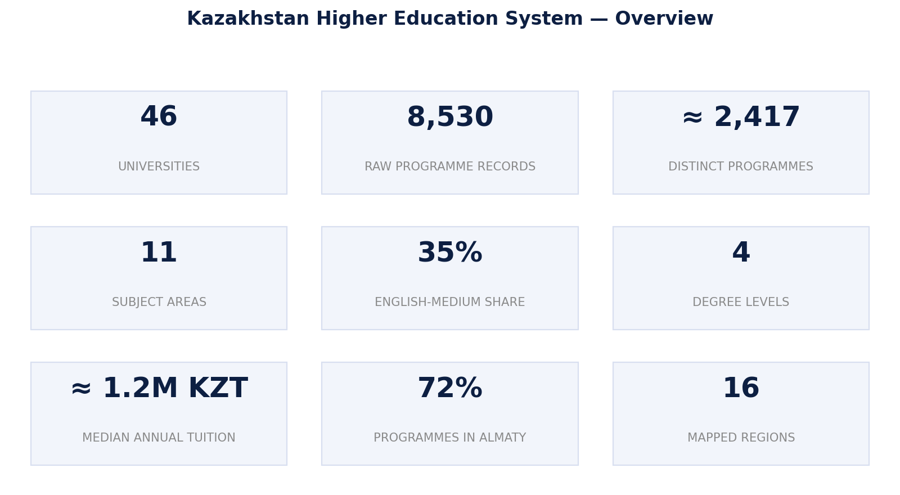

# Figure 1 — Overview of Kazakhstan's Higher Education System

## Purpose

Provide a high-level, at-a-glance overview of the scale and structure of Kazakhstan's higher education system, as a visual entry point before the detailed analysis.

## Chart Type

Infographic / Summary Stat Panel

## Variables

- Number of universities
- Number of raw programme records / distinct programmes
- Number of subject areas and degree levels
- English-medium share
- Median annual tuition
- Share of programmes located in Almaty
- Number of mapped regions

## Key Message

The dataset provides broad national coverage (46 universities, ~2,417 distinct programmes) but the market is structurally concentrated — geographically in Almaty and, in English-medium terms, in a subset of fields.

## Source

OPVO/EPVO Registry, consolidated dataset (2026).

## Figure

