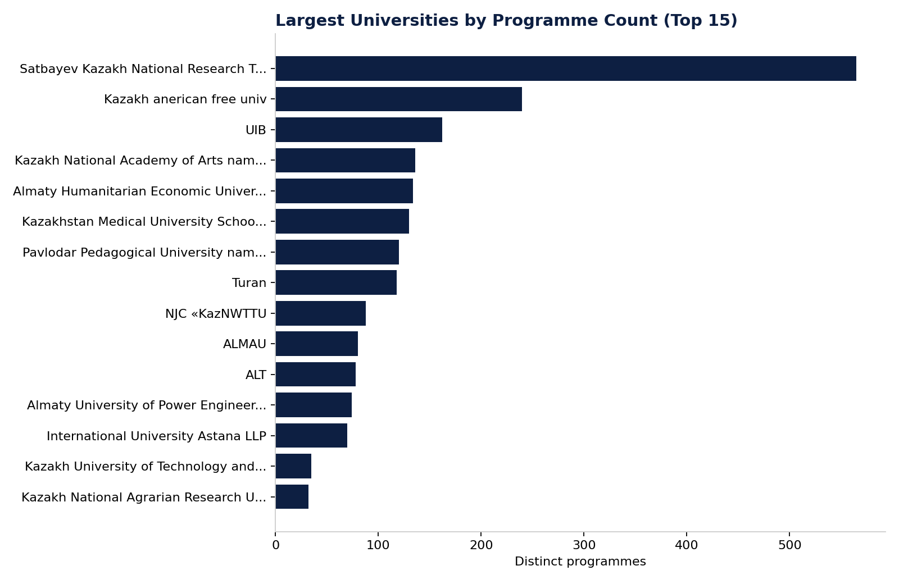

# Figure 2 — Largest Universities by Programme Count

## Purpose

Show the institutional scale distribution across the market and identify which universities dominate the programme catalogue by volume.

## Chart Type

Horizontal Bar Chart (Top 15)

## Variables

- University name
- Distinct programme count

## Key Message

Institutional scale is highly uneven — the largest institutions in the dataset contribute a disproportionate share of the national programme catalogue, while most universities in the full set of 46 contribute far fewer programmes each.

## Source

OPVO/EPVO Registry, consolidated dataset (2026).

## Figure

