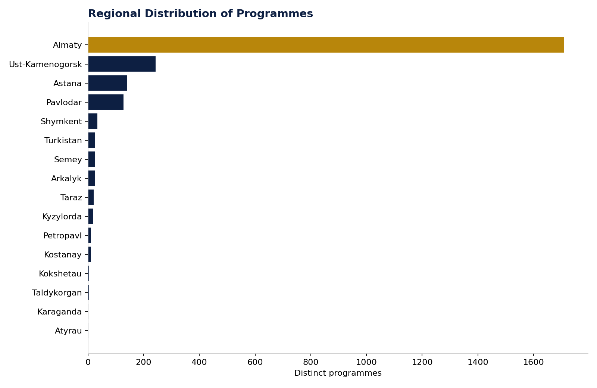

# Figure 3 — Regional Distribution of Programmes

## Purpose

Show how programme supply is distributed across Kazakhstan's regions, to identify geographic concentration and regional gaps.

## Chart Type

Horizontal Bar Chart

## Variables

- Region (inferred from university location)
- Distinct programme count

## Key Message

Almaty (highlighted) holds a large majority of national programme supply; most other regions offer only a small fraction each, confirming the market's geographic concentration.

## Source

OPVO/EPVO Registry, consolidated dataset (2026); region inferred from university location — see report Appendix A.

## Figure

