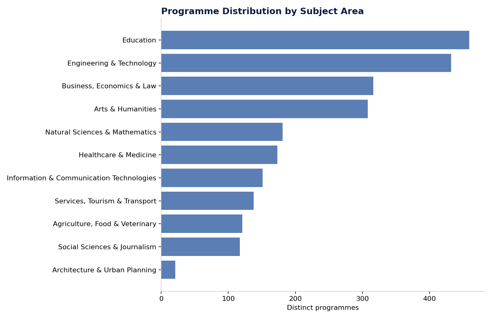

# Figure 4 — Programme Distribution by Subject Area

## Purpose

Show the composition of the national programme catalogue across the 11 broad subject-area categories.

## Chart Type

Horizontal Bar Chart

## Variables

- Subject area
- Distinct programme count

## Key Message

Education, Engineering & Technology, and Business/Economics/Law together account for the largest share of the catalogue; Architecture & Urban Planning is the smallest category by a wide margin.

## Source

OPVO/EPVO Registry, consolidated dataset (2026).

## Figure

