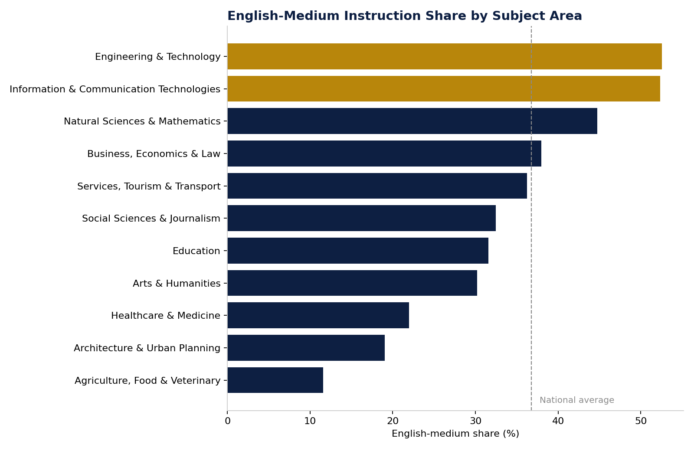

# Figure 5 — English-Medium Instruction Share by Subject Area

## Purpose

Show how English-medium instruction availability varies across subject areas, to identify which fields are internationally ready and which are not.

## Chart Type

Horizontal Bar Chart with reference line (national average)

## Variables

- Subject area
- English-medium share (%)

## Key Message

English-medium provision is heavily field-dependent, ranging from over three-quarters of ICT programmes to roughly one in ten Agriculture and Veterinary programmes — a near eight-fold spread around the national average.

## Source

OPVO/EPVO Registry, consolidated dataset (2026).

## Figure

