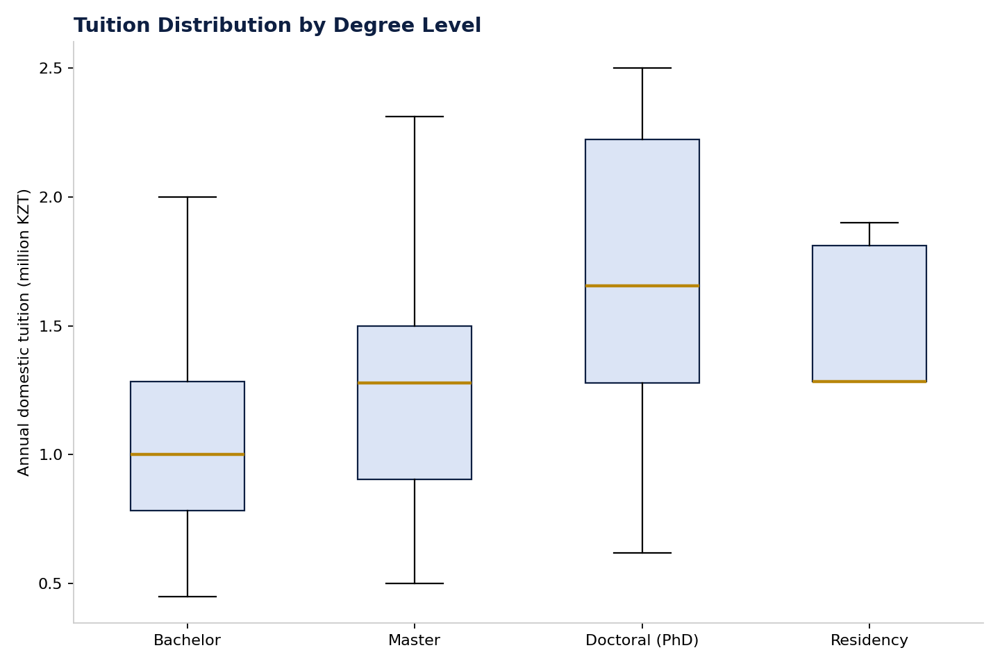

# Figure 6 — Tuition Distribution by Degree Level

## Purpose

Show how domestic tuition fees are distributed across the four degree levels, establishing the core pricing benchmark for the market.

## Chart Type

Box Plot

## Variables

- Degree level (Bachelor's, Master's, Doctoral, Residency)
- Annual domestic tuition (KZT)

## Key Message

Tuition rises consistently from Bachelor's to Doctoral level; Residency shows the narrowest price spread of any degree level.

## Source

OPVO/EPVO Registry, consolidated dataset (2026).

## Figure

