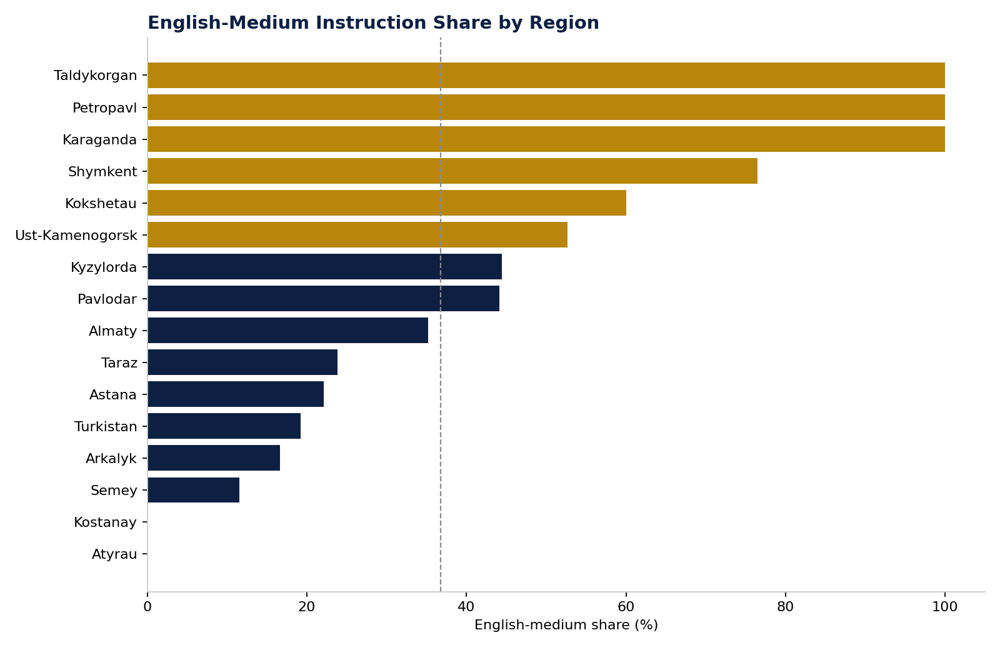

# Figure 7 — English-Medium Instruction Share by Region

## Purpose

Show how English-medium provision varies geographically, complementing the subject-area view in Figure 5.

## Chart Type

Horizontal Bar Chart with reference line (national average)

## Variables

- Region (inferred)
- English-medium share (%)

## Key Message

English-medium share varies widely by region; most regions outside Almaty and the largest secondary cities sit below the national average.

## Source

OPVO/EPVO Registry, consolidated dataset (2026); region inferred from university location.

## Figure

