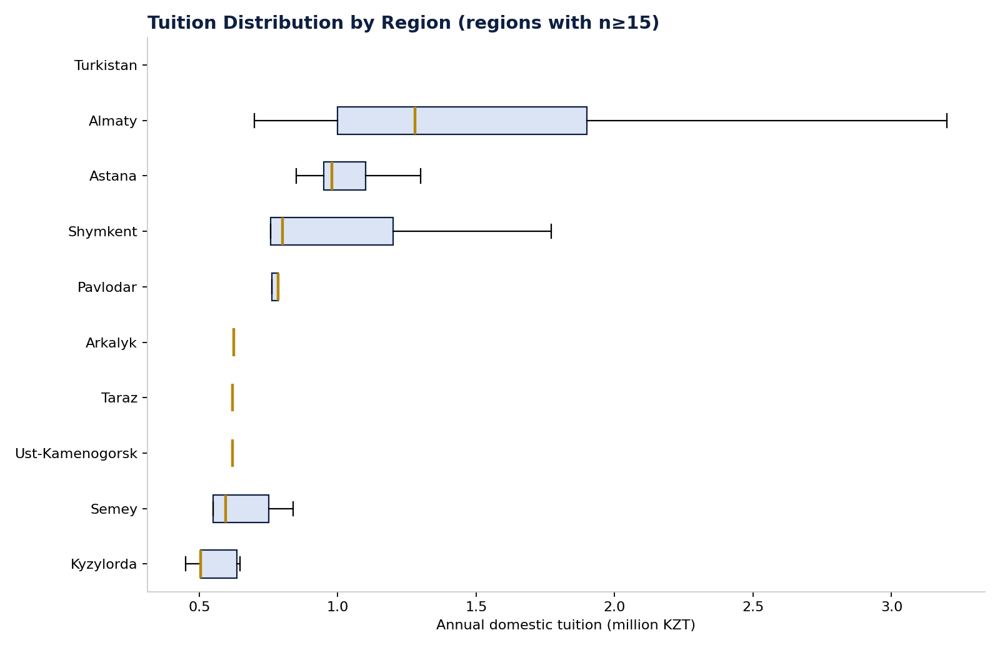

# Figure 8 — Tuition Distribution by Region

## Purpose

Compare domestic tuition levels across regions with sufficient sample size, to assess whether regional price differences are as large as regional supply differences.

## Chart Type

Box Plot (horizontal)

## Variables

- Region (regions with n≥15 programmes)
- Annual domestic tuition (KZT)

## Key Message

Regional price variation is real but modest compared to regional availability variation (Figure 3) — the market's main regional inequality is one of catalogue breadth, not price.

## Source

OPVO/EPVO Registry, consolidated dataset (2026); region inferred from university location.

## Figure

