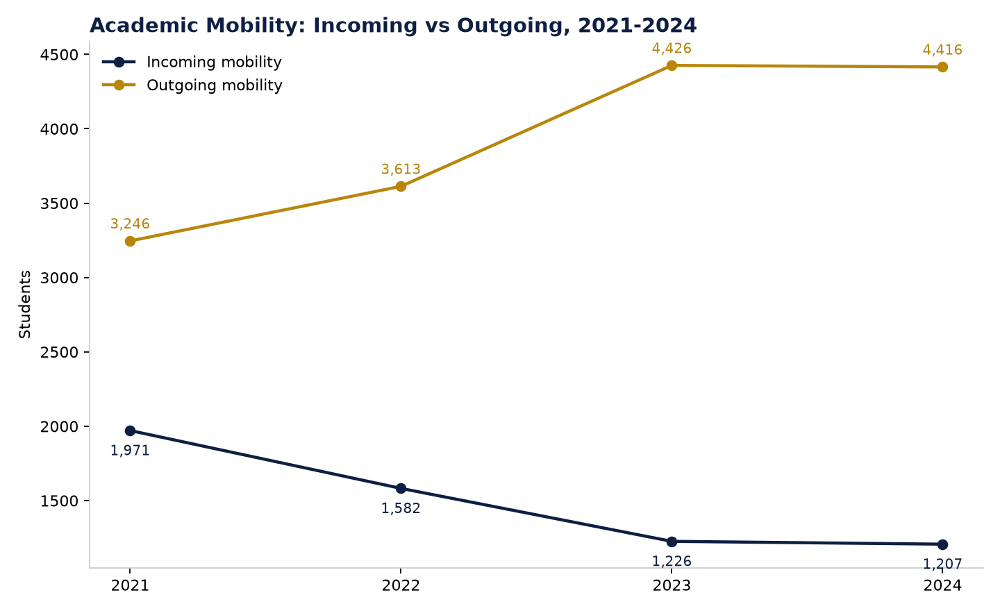

# Figure 1 — Academic Mobility: Incoming vs Outgoing, 2021-2024

## Purpose
Show the overall trajectory of Kazakhstan's inbound and outbound academic mobility side by side.

## Chart Type
Line chart (two series)

## Variables
- Year (2021-2024)
- Incoming mobility students
- Outgoing mobility students (reconciled figure — see Section 13 of the report)

## Key Message
Outgoing mobility has grown steadily (3,246 to 4,416) while incoming mobility has declined every year (1,971 to 1,207) — the gap between outbound and inbound mobility has widened substantially since 2021.

## Source
National Report on Higher Education 2024, Tables 6.1.1 and 6.1.13.

## Figure

