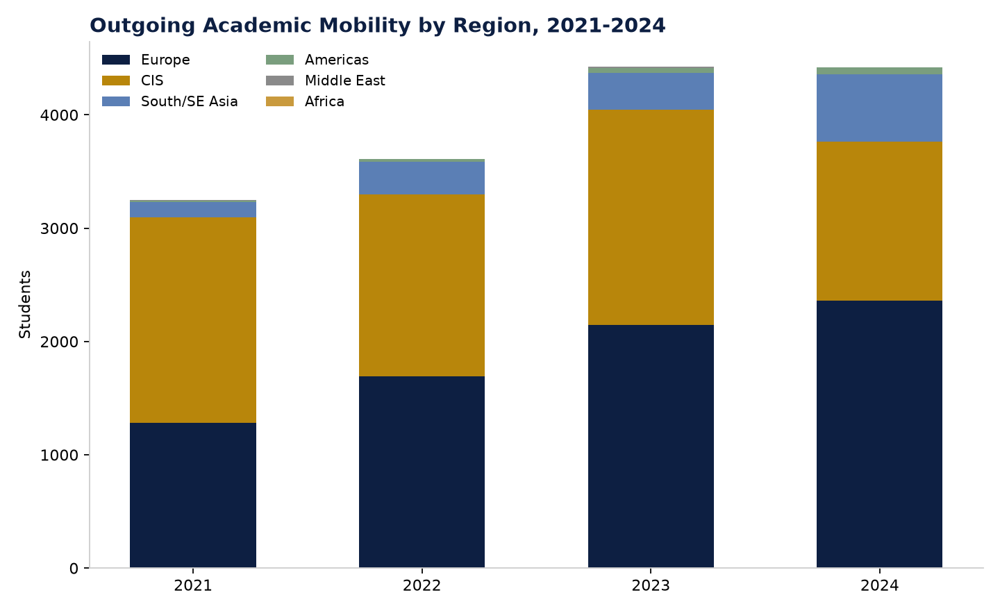

# Figure 2 — Outgoing Academic Mobility by Region, 2021-2024

## Purpose
Show how the regional composition of outgoing mobility has shifted over time.

## Chart Type
Stacked bar chart

## Variables
- Year (2021-2024)
- Region (Europe, CIS, South/SE Asia, Americas, Middle East, Africa)

## Key Message
CIS's share of outgoing mobility has fallen sharply (1,902 to 1,402 between 2023-2024) while Europe has grown to become the largest single region (2,360 in 2024) — a possible substitution effect, though only one year of directional change.

## Source
National Report on Higher Education 2024, Table 6.1.13.

## Figure

