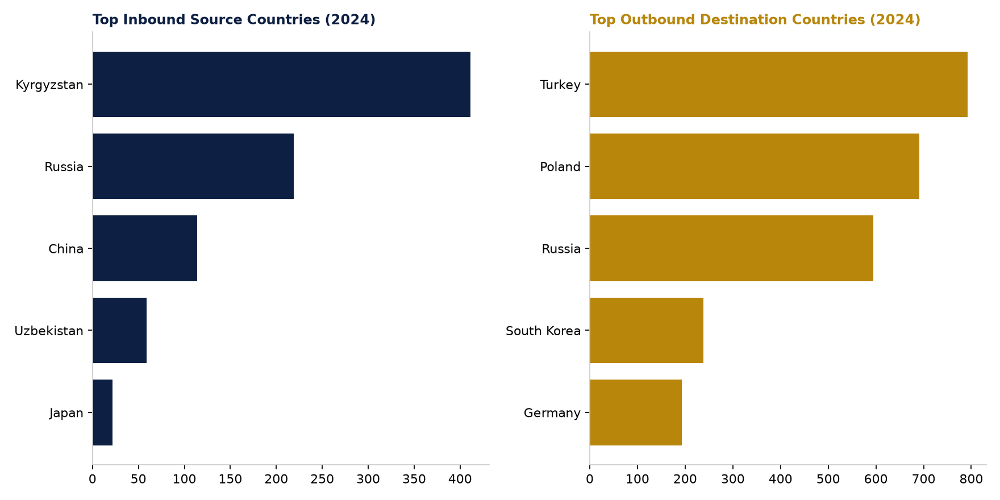

# Figure 3 — Top Inbound Source vs. Outbound Destination Countries, 2024

## Purpose
Compare which countries send students to Kazakhstan against which countries Kazakhstani students go to, side by side.

## Chart Type
Paired horizontal bar charts

## Variables
- Country
- Students (2024)

## Key Message
The two lists barely overlap: Kyrgyzstan, Russia, and China lead inbound mobility, while Turkey, Poland, Russia, and South Korea lead outbound destinations — Russia is the only country appearing prominently on both sides.

## Source
National Report on Higher Education 2024, Tables 6.1.3-6.1.5 (incoming) and 6.1.9-6.1.11 (outgoing).

## Figure

