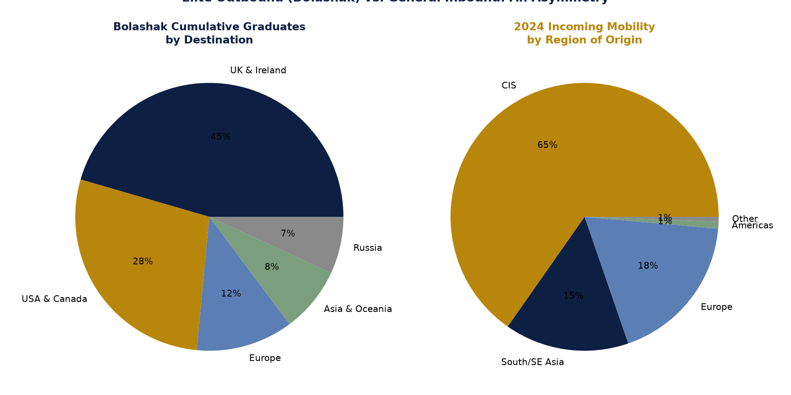

# Figure 4 — Elite Outbound (Bolashak) vs. General Inbound: An Asymmetry

## Purpose
Visualise the structural asymmetry between Kazakhstan's state-funded elite outbound scholars and its general inbound student population (Insight #3).

## Chart Type
Paired pie charts

## Variables
- Bolashak cumulative graduates, by destination region
- 2024 incoming mobility students, by region of origin

## Key Message
73.5% of Bolashak's cumulative graduates went to the UK/Ireland or USA/Canada, while inbound mobility is overwhelmingly CIS-dominated (65% in 2024) — Kazakhstan runs what look like two largely separate internationalisation channels.

## Source
National Report on Higher Education 2024 (Bolashak cumulative data and Table 6.1.6/6.1.13).

## Figure

