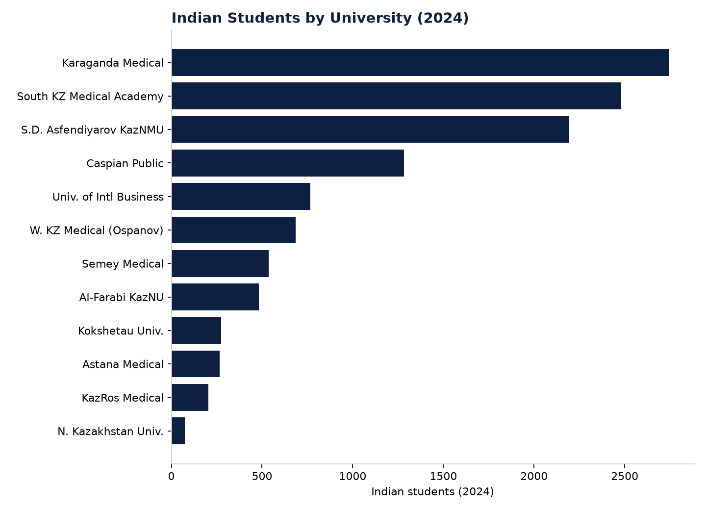

# Figure 5 — Indian Students by University, 2024

## Purpose
Show the concentration of Kazakhstan's largest single foreign-student nationality (India) across specific universities.

## Chart Type
Horizontal bar chart

## Variables
- University
- Indian students enrolled (2024)

## Key Message
Indian students are concentrated almost entirely in a specific set of medical universities (11,997 of 12,020 total, 99.8%) — this is one of the most concentrated, single-country/single-field patterns found anywhere in WP2.

## Source
National Report on Higher Education 2024 (Indian students by university table).

## Figure

