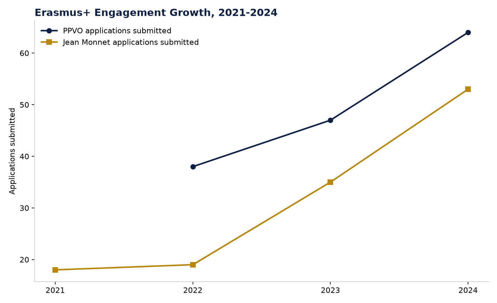

# Figure 6 — Erasmus+ Engagement Growth, 2021-2024

## Purpose
Show the growth trajectory of Kazakhstani university participation in two Erasmus+ mechanisms.

## Chart Type
Line chart (two series)

## Variables
- Year
- PPVO applications submitted (2022-2024)
- Jean Monnet applications submitted (2021-2024)

## Key Message
Both mechanisms show strong percentage growth in 2024 (PPVO +36%, Jean Monnet +52%) from a small base — an emerging but not yet major internationalisation channel relative to CIS-oriented mobility.

## Source
National Report on Higher Education 2024, Figures 6.5.4 and 6.5.5.

## Figure

