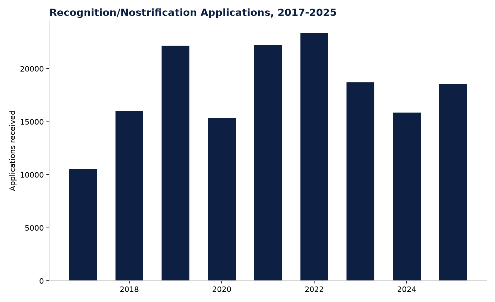

# Figure 7 — Recognition/Nostrification Applications, 2017-2025

## Purpose
Show the multi-year trend in applications for recognition of foreign educational qualifications.

## Chart Type
Bar chart

## Variables
- Year (2017-2025)
- Applications received

## Key Message
Applications peaked in 2022 (23,372) and have since settled at a somewhat lower but still elevated level (18,557 in 2025) — recognition activity has grown substantially since 2017 (10,524) despite the recent plateau.

## Source
Borgekova et al. (2026), Table 1.

## Figure

